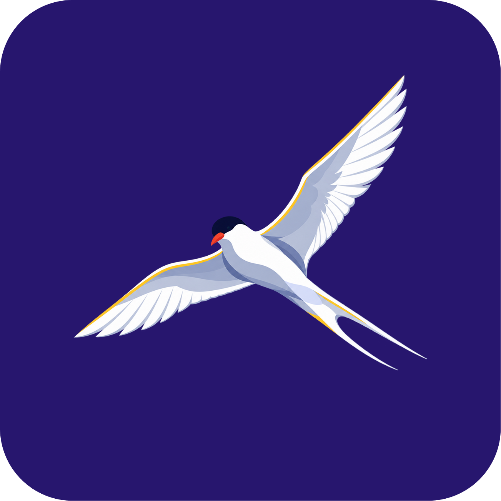
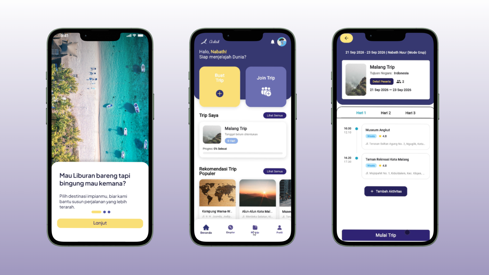

<div align="center">

  

  <p align="center">
    
  </p>

  # Arktik

  **Arktik is a Flutter-based mobile application designed to help users plan, manage, and execute their travel trips effectively with integrated Google Calendar scheduling.**

  <br />

  
  

</div>

---

## Table of contents

- [Project overview](#project-overview)
- [Key features](#key-features)
- [Technology stack](#technology-stack)
- [Project structure](#project-structure)
- [Team](#team)

## Project overview

| Item | Details |
| --- | --- |
| Application Type | Cross-platform (Mobile) |
| Primary Platform | Android / iOS |

Arktik is a digital platform designed for travelers and groups who need an efficient way to organize their trips. By integrating destination discovery, itinerary planning, member management, and Google Calendar syncing, Arktik solves the hassle of scattered travel plans and ensures everyone involved stays on the same page.

## Key features

| Feature | What the user can do |
| --- | --- |
| Destination Discovery | Browse and explore various travel destinations seamlessly. |
| Trip Management | Create and manage trips, including setting start and end dates, and organizing daily itineraries. |
| Group Collaboration | Invite members to trips, manage roles (Leader/Member), and use invitation codes for easy joining. |
| Google Calendar Integration | Automatically synchronize your travel itineraries and availability directly to Google Calendar. |
| Trip Checklist | Keep track of essential items and tasks for the trip to ensure nothing is left behind. |


## Technology stack

| Category | Technology | Purpose |
| --- | --- | --- |
| Frontend | Flutter (Dart) | UI Framework for building cross-platform applications |
| Architecture | Feature-First Clean Architecture | Modular structure organized by feature, utilizing Clean Architecture internally |
| State Management | Provider | Efficient and scalable state management for app features |
| Backend | Supabase | Backend-as-a-Service providing secure and scalable infrastructure |
| Database | PostgreSQL (Supabase) | Relational database for storing trips, members, and itineraries |
| Authentication | Supabase Auth + Google OAuth | Secure user authentication and social login |
| External API | Google Calendar API (`googleapis`) | Fetching user availability and syncing trip schedules |

## Project structure

```text
├── lib/
│   ├── core/         # Core components (e.g., router, themes, widgets, constants)
│   ├── features/     # Main features (auth, beranda, destination, google_calendar, profile, trip)
│   │   ├── auth/     # Authentication feature (Login, Register)
│   │   ├── trip/     # Trip management, creation, details, and checklist
│   │   └── ...       # Other feature modules
│   └── main.dart     # Entry point of the application
├── assets/           # Images, icons, fonts, and static assets
├── supabase/         # Database schemas
└── pubspec.yaml      # Project dependencies and configurations
```

## Getting Started

To get a local copy up and running, follow these simple steps.

### Prerequisites

*   Flutter SDK installed on your machine (version 3.12.2 or higher).
*   An editor like VS Code or Android Studio.
*   A Supabase project setup for backend services.

### Installation

1.  **Clone the repo**
    ```sh
    git clone https://github.com/nabathnm/arktik.git
    ```
2.  **Navigate to the project directory**
    ```sh
    cd arktik
    ```
3.  **Configure Google Cloud Console (OAuth & Calendar API)**
    * Go to the [Google Cloud Console](https://console.cloud.google.com/).
    * Create a new project.
    * Navigate to **APIs & Services > Library** and enable the **Google Calendar API**.
    * Navigate to **APIs & Services > OAuth consent screen** and configure it (Add your test users if in testing mode). Make sure to add the Calendar scopes (`https://www.googleapis.com/auth/calendar` or `https://www.googleapis.com/auth/calendar.events`).
    * Navigate to **APIs & Services > Credentials** and create an **OAuth 2.0 Client ID** (Web application).
    * Copy the **Client ID** and **Client Secret**.

4.  **Configure Supabase Authentication**
    * Go to your [Supabase Dashboard](https://supabase.com/dashboard).
    * Navigate to **Authentication > Providers** and enable **Google**.
    * Paste the **Client ID** and **Client Secret** obtained from Google Cloud Console.
    * Copy the **Callback URL (for OAuth)** from Supabase and paste it into the **Authorized redirect URIs** in your Google Cloud Console's Web Client ID settings.

5.  **Setup Environment Variables**
    Create a `.env` file in the root directory and add your credentials:
    ```env
    SUPABASE_URL=your_supabase_url
    SUPABASE_ANON_KEY=your_supabase_anon_key
    GOOGLE_WEB_CLIENT_ID=your_google_web_client_id
    ```
    *(Note: The `GOOGLE_WEB_CLIENT_ID` should be the same Web Client ID you created in Google Cloud Console.)*

6.  **Install dependencies**
    ```sh
    flutter pub get
    ```
7.  **Run the app**
    ```sh
    flutter run
    ```

---

## Team

| Name | Role | Responsibilities | Contact |
| --- | --- | --- | --- |
| Shelfina Khayla Anindita | Product Manager | Overseeing project requirements and timeline | linkedin.com/in/nabath-nuur |
| Naufaldo Dafa Zaki Bastian | UI/UX Designer | Designing application interfaces and user flows | linkedin.com/in/naufaldo-dafa-zb |
| Nabath Nur Muhammad | Mobile Engineer | Developing the Flutter application and integration | linkedin.com/in/shelfina-khayla-anindita |
